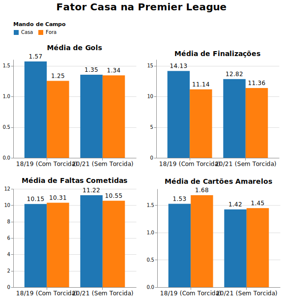
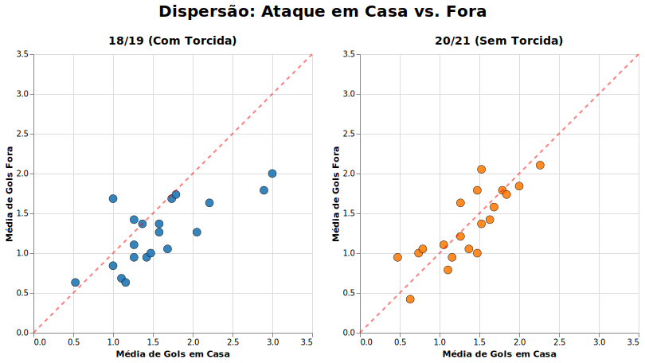

# Relatório

## Identificação

- **Nome**: Leonardo Leal Linhares Dias
- **Cartão UFRGS:** 326011

## Dados utilizados

1. **Dataset English Premier League**: <https://datahub.io/football/english-premier-league>
    * **Descrição curta**: Dados estatísticos de todas as 380 partidas da primeira divisão inglesa (Premier League) em diversas temporadas, para esse laboraório, foram usados especificamente os dados das temporadas 2018/2019 (temporada regular) e 2020/2021 (temporada em que as primeiras 36 rodadas foram jogadas com portões fechados, em decorrência da pandemia de COVID-19).

## Código-fonte da visualização

- **Arquivo principal**: [plot.ipynb](plot.ipynb)

## Imagem da visualização gerada

***Observação:*** A imagem abaixo é um registro estático da visualização. Por se tratar de um painel exploratório interativo construído com a biblioteca Altair, a interação completa pode ser acessada executando as células do notebook plot.ipynb no Jupyter ou Google Colab.

## Descrição da visualização

### Legenda (*caption*)

A visualização é dividida em duas partes complementares. A primeira consiste em um painel de gráficos de barras que compara as médias por partida de variáveis ofensivas (Gols e Finalizações) e disciplinares (Faltas Cometidas e Cartões Amarelos) entre times mandantes (azul) e visitantes (laranja) nas temporadas 18/19 e 20/21. A segunda parte apresenta um painel interativo de gráficos de dispersão, onde o eixo horizontal representa a média de gols em casa e o vertical, a média de gols fora. Uma linha de referência pontilhada vermelha (y=x) demarca o equilíbrio ofensivo (um time que tem média de gols fora de casa igual a média de gols em casa). A interação com o cursor aciona uma seleção vinculada: ao repousar sobre um clube, o ponto correspondente é destacado simultaneamente em ambas as temporadas, exibindo um rótulo flutuante em texto com os valores de cada média e o nome do clube.

### Conclusão demonstrada pela visualização

Através do painel de barras, notamos dois padrões na temporada sem torcida (20/21). Primeiro, o ímpeto ofensivo do mandante decaiu, com uma redução considerável de finalizações. Segundo, houve uma inversão no cenário disciplinar: na presença do público (18/19), o time da casa cometia menos faltas e recebia menos cartões amarelos. Sem a pressão das arquibancadas, o mandante passou a cometer mais faltas que o visitante (saltando de 10.15 para 11.22 por jogo), e a disparidade nos cartões desapareceu. Isso evidencia que a torcida atua inibindo as infrações do próprio time e, possivelmente, influenciando o árbitro a ser mais indulgente com os donos da casa.

Esse esvaziamento do fator casa é confirmado pelo gráfico de dispersão interativo. Na temporada 18/19, a vasta maioria dos clubes encontra-se abaixo da bissetriz, marcando muito gols em seus domínios. Já na temporada 20/21, observa-se um fenômeno de convergência dos pontos em direção à linha de equilíbrio. Clubes que antes possuíam uma significativa disparidade ofensiva tiveram suas médias aproximadas, comprovando graficamente que a ausência do público neutralizou as vantagens de se jogar em casa.

Portanto, conclui-se que o "fator casa" na Premier League é fortemente impulsionado pela presença da torcida no estádio, não se tratando apenas do conforto ou conhecimento do próprio campo.
